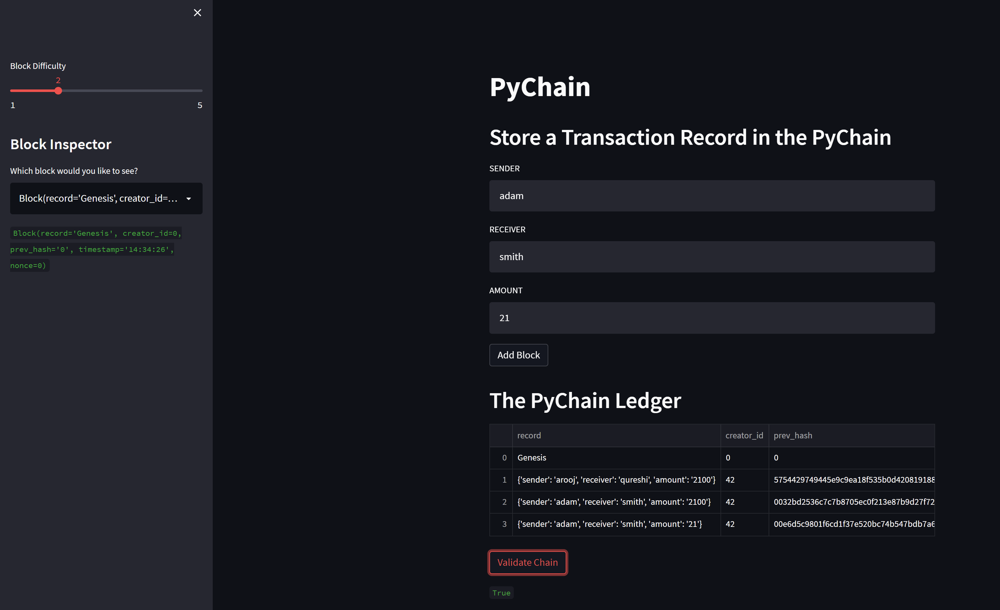

# Blockchain
## Fintech Course Assignments

### Assignment # 1: Blockchain-based Ledger System
### Purpose
To create a blockchain-based ledger system with a simple interactive frontend developed in Streamlit. 

#### STEP-1

User will enter the information of a 
- receiver
- sender and the 
- amount

#### STEP-2

Ledger with be created. 

#### STEP-3: Difficulty/ complexity level

difficulty level can be changed to make a valid transaction by the miner. 

#### STEP-4:
validity of the ledger can be checked by comparing the hash of the previous-transaction (saved as prev-hash value) with the actual hash of the previous transaction

#### FRONT-END DISPLAY

